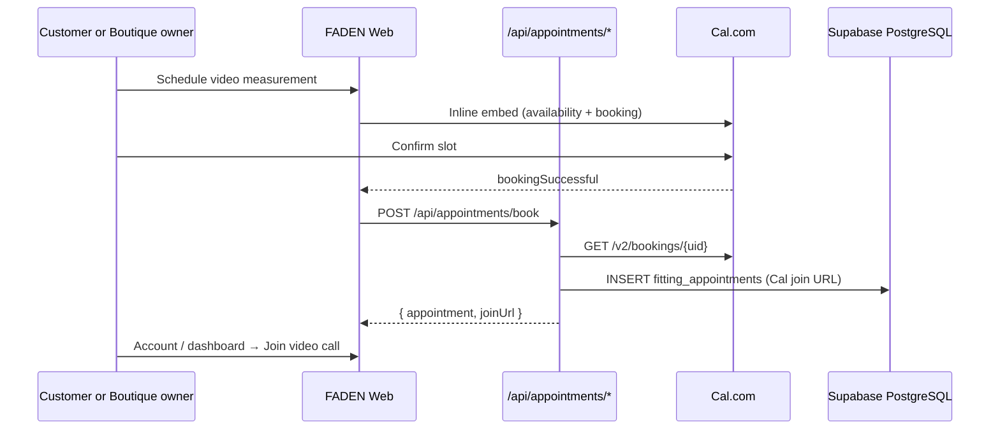

# Video Fitting Appointments — Architecture

FADEN uses **Cal.com only** for scheduling and video (Cal Video, Google Meet, or Zoom on the event type). No Daily.co required.

## System diagram



## Database

Migration: `packages/database/src/schema/012_fitting_appointments.sql`  
Owner booking RLS: `013_fitting_appointments_owner_book.sql`

| Column | Purpose |
|--------|---------|
| `cal_booking_uid` | Cal.com booking reference |
| `daily_room_url` | **Cal.com video / booking join URL** (legacy column name) |
| `scheduled_start` / `scheduled_end` | From Cal.com |

## Environment variables

```bash
NEXT_PUBLIC_CALCOM_NAMESPACE=faden-j8bp3k
NEXT_PUBLIC_CALCOM_EVENT_SLUG=video-measurement
CALCOM_API_KEY=cal_live_...
CALCOM_WEBHOOK_SECRET=your-webhook-secret   # optional
```

Set the Cal.com event type **Location** to **Cal Video** (or Google Meet / Zoom).

## API endpoints

| Method | Path | Description |
|--------|------|-------------|
| `POST` | `/api/appointments/book` | Cal verify → save join URL → DB |
| `GET` | `/api/appointments` | Customer appointments |
| `GET` | `/api/appointments?role=tailor` | Boutique owner appointments |
| `POST` | `/api/appointments/webhooks/calcom` | Optional Cal webhook |

## Cal.com setup

1. Event type `video-measurement` with **Cal Video** (or Meet/Zoom) as location.
2. API key → `CALCOM_API_KEY`.
3. Namespace + slug → `NEXT_PUBLIC_CALCOM_NAMESPACE` / `NEXT_PUBLIC_CALCOM_EVENT_SLUG`.
